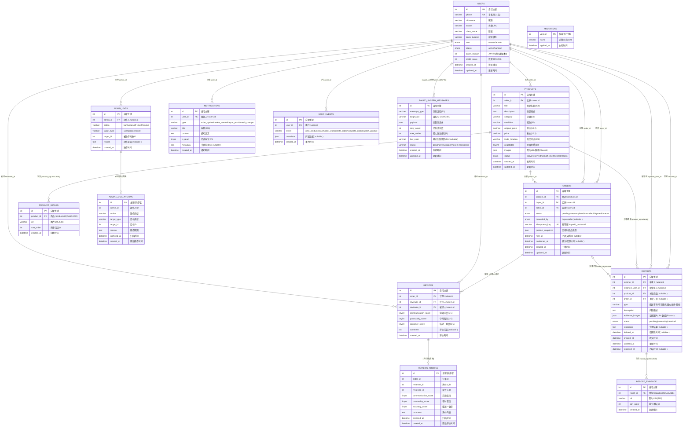

# 数据库 ER 图：校园二手交易小程序

**创建日期：** 2026-06-04
**数据来源：** [技术架构文档 §四](技术架构文档.md) DDL + §八 failed_system_messages
**数据库：** MySQL 8.0 InnoDB，utf8mb4
**表总数：** 14 张（10 核心业务表 + 2 归档表 + 1 迁移管理表 + 1 IM 重试表）

---

## 一、实体概览

| # | 表名 | 中文名 | 类型 | 行数预估 | 说明 |
|:--:|------|--------|------|:--------:|------|
| 1 | `users` | 用户 | 核心 | 1000+ | 买家/卖家/客服/管理员统一用户表 |
| 2 | `products` | 商品 | 核心 | 5000+ | 商品信息，含 FULLTEXT 全文索引 |
| 3 | `orders` | 订单 | 核心 | 10000+ | 交易记录，含商品快照与幂等键 |
| 4 | `reviews` | 评价 | 核心 | 20000+ | 互评记录（每笔订单最高 2 条） |
| 5 | `reports` | 举报 | 核心 | 500+ | 举报/申诉，软删除 |
| 6 | `admin_logs` | 管理日志 | 核心 | 1000+ | 管理员操作审计 |
| 7 | `product_images` | 商品图片 | 拆分表 | 30000+ | Phase 2 替代 products.images JSON |
| 8 | `report_evidence` | 举报证据 | 拆分表 | 2000+ | Phase 2 替代 reports.evidence_images JSON |
| 9 | `notifications` | 通知 | 核心 | 50000+ | 统一通知中心，30 天自动清理 |
| 10 | `user_events` | 用户事件 | 核心 | 100000+ | 行为埋点，运营数据统计 |
| 11 | `admin_logs_archive` | 管理日志归档 | 归档 | — | 6 个月以上数据迁移至此，无外键 |
| 12 | `reviews_archive` | 评价归档 | 归档 | — | 1 年以上数据迁移至此，无外键 |
| 13 | `migrations` | 迁移版本 | 元数据 | < 50 | Schema 版本管理（UP/DOWN 迁移系统） |
| 14 | `failed_system_messages` | IM 失败消息 | 辅助 | < 1000 | IM 系统消息发送失败重试，5 次上限 |

---

## 二、ER 图（Mermaid）



---

## 三、关系规格表

每条关系逐项列出：源表 → 目标表、外键列、是否可空、删除策略、约束说明。

### 3.1 users 出发的关系

| # | 源表 | 目标表 | FK 列 | Nullable | ON DELETE | 基数 | 说明 |
|:--:|------|--------|-------|:--------:|-----------|------|------|
| R1 | products | users | `seller_id` | ❌ | RESTRICT | 1:N | 一个用户可发布多件商品 |
| R2 | orders | users | `buyer_id` | ❌ | RESTRICT | 1:N | 一个用户可购买多笔订单 |
| R3 | orders | users | `seller_id` | ❌ | RESTRICT | 1:N | 一个用户可售出多笔订单 |
| R4 | reviews | users | `reviewer_id` | ❌ | RESTRICT | 1:N | 一个用户可发表多条评价 |
| R5 | reviews | users | `reviewee_id` | ❌ | RESTRICT | 1:N | 一个用户可收到多条评价 |
| R6 | reports | users | `reporter_id` | ❌ | RESTRICT | 1:N | 一个用户可提交多条举报 |
| R7 | reports | users | `reported_user_id` | ❌ | RESTRICT | 1:N | 一个用户可被多次举报 |
| R8 | admin_logs | users | `admin_id` | ❌ | RESTRICT | 1:N | 一个管理员可有多条操作记录 |
| R9 | notifications | users | `user_id` | ❌ | RESTRICT | 1:N | 一个用户可有多条通知 |
| R10 | user_events | users | `user_id` | ❌ | RESTRICT | 1:N | 一个用户可有多条行为事件 |

### 3.2 业务实体间关系

| # | 源表 | 目标表 | FK 列 | Nullable | ON DELETE | 基数 | 说明 |
|:--:|------|--------|-------|:--------:|-----------|------|------|
| R11 | orders | products | `product_id` | ❌ | RESTRICT | 1:N | 一件商品可产生多笔订单（同一商品被多次发布后卖出） |
| R12 | reviews | orders | `order_id` | ❌ | RESTRICT | 1:1..2 | 每笔订单最多 2 条评价（买家↔卖家互评），UNIQUE KEY 保证同方向不重复 |
| R13 | reports | products | `product_id` | ✅ | RESTRICT | 0..1:N | 举报可选关联商品（如"辱骂骚扰"类可不关联商品） |
| R14 | reports | orders | `order_id` | ✅ | RESTRICT | 0..1:N | 举报可选关联订单（如"疑似骗子"类可不关联订单） |

### 3.3 CASCADE 关系 (Phase 2 拆分表)

| # | 源表 | 目标表 | FK 列 | Nullable | ON DELETE | 基数 | 说明 |
|:--:|------|--------|-------|:--------:|-----------|------|------|
| R15 | product_images | products | `product_id` | ❌ | **CASCADE** | 1:N | 商品删除时图片记录级联清除 |
| R16 | report_evidence | reports | `report_id` | ❌ | **CASCADE** | 1:N | 举报删除时证据图片记录级联清除 |

### 3.4 逻辑关系（无物理外键）

| # | 源表 | 目标表 | 关联方式 | 说明 |
|:--:|------|--------|----------|------|
| L1 | admin_logs_archive | — | `id = admin_logs.id` | 归档表与源表结构一致，无外键。归档时直接 INSERT ... SELECT，源表行可能被清理 |
| L2 | reviews_archive | — | `id = reviews.id` | 同上。"归档表不设外键约束——归档数据为历史快照，源表对应行可能已被删除" |
| L3 | failed_system_messages | users | `target_uid` 对应 `users.id` | IM UserID 与服务端用户 ID 一致，但跨系统不设外键约束 |

---

## 四、表字段规格

### 4.1 users（用户）

| # | 字段 | 类型 | 约束 | 默认值 | 说明 |
|:--:|------|------|------|--------|------|
| 1 | `id` | INT | PK AUTO_INCREMENT | — | 用户 ID |
| 2 | `phone` | VARCHAR(11) | NOT NULL, UNIQUE | — | 手机号（微信 getPhoneNumber） |
| 3 | `nickname` | VARCHAR(50) | NOT NULL | `''` | 昵称 |
| 4 | `avatar` | VARCHAR(500) | — | `''` | 头像 URL |
| 5 | `class_name` | VARCHAR(100) | — | `''` | 班级（自填，增强信任） |
| 6 | `dorm_building` | VARCHAR(100) | — | `''` | 宿舍楼栋（自填） |
| 7 | `role` | ENUM('user','cs','admin') | NOT NULL | `'user'` | 角色 |
| 8 | `status` | ENUM('active','banned') | NOT NULL | `'active'` | 账号状态 |
| 9 | `token_version` | INT | NOT NULL | `1` | JWT 主动失效版本号，封禁时 +1 |
| 10 | `credit_score` | INT | NOT NULL | `100` | 信誉分，范围 [−∞, 200] |
| 11 | `created_at` | DATETIME | NOT NULL | `CURRENT_TIMESTAMP` | 注册时间 |
| 12 | `updated_at` | DATETIME | NOT NULL | `CURRENT_TIMESTAMP ON UPDATE` | 更新时间 |

### 4.2 products（商品）

| # | 字段 | 类型 | 约束 | 默认值 | 说明 |
|:--:|------|------|------|--------|------|
| 1 | `id` | INT | PK AUTO_INCREMENT | — | 商品 ID |
| 2 | `seller_id` | INT | NOT NULL, FK→users | — | 卖家 ID |
| 3 | `title` | VARCHAR(200) | NOT NULL | — | 商品标题 |
| 4 | `description` | TEXT | — | NULL | 商品描述 |
| 5 | `category` | VARCHAR(50) | NOT NULL | — | 分类（电子产品/书籍教材/生活用品/服饰鞋包/运动户外/其他） |
| 6 | `condition` | VARCHAR(50) | NOT NULL | — | 成色（全新/95新/9成新/8成新/7成新及以下） |
| 7 | `original_price` | DECIMAL(10,2) | NOT NULL | — | 原价 |
| 8 | `price` | DECIMAL(10,2) | NOT NULL | — | 期望售价 |
| 9 | `trade_location` | VARCHAR(200) | NOT NULL | — | 面交地点 |
| 10 | `negotiable` | TINYINT(1) | NOT NULL | `1` | 是否接受议价（0=否，1=是） |
| 11 | `images` | JSON | — | NULL | Phase 1 图片 URL 数组 |
| 12 | `status` | ENUM('active','reserved','sold','off_shelf','deleted','frozen') | NOT NULL | `'active'` | 商品状态 |
| 13 | `created_at` | DATETIME | NOT NULL | `CURRENT_TIMESTAMP` | 发布时间 |
| 14 | `updated_at` | DATETIME | NOT NULL | `CURRENT_TIMESTAMP ON UPDATE` | 更新时间 |

**商品状态说明：**

| 状态 | 含义 | 触发条件 |
|------|------|----------|
| `active` | 在售 | 发布即上架 |
| `reserved` | 已预定 | 买家下单后商品自动标记（有人点了"我想要"） |
| `sold` | 已售出 | 订单确认收货 |
| `off_shelf` | 下架 | 管理员手动下架、举报成立下架、卖家自行下架 |
| `deleted` | 删除 | 卖家删除商品（软标记） |
| `frozen` | 冻结 | 举报处理中临时冻结 |

### 4.3 orders（订单）

| # | 字段 | 类型 | 约束 | 默认值 | 说明 |
|:--:|------|------|------|--------|------|
| 1 | `id` | INT | PK AUTO_INCREMENT | — | 订单 ID |
| 2 | `product_id` | INT | NOT NULL, FK→products | — | 商品 ID |
| 3 | `buyer_id` | INT | NOT NULL, FK→users | — | 买家 ID |
| 4 | `seller_id` | INT | NOT NULL, FK→users | — | 卖家 ID |
| 5 | `status` | ENUM('pending','met','completed','cancelled','disputed','timeout') | NOT NULL | `'pending'` | 订单状态 |
| 6 | `cancelled_by` | ENUM('buyer','seller') | — | NULL | 取消方（仅 cancelled 状态有意义） |
| 7 | `idempotent_key` | VARCHAR(100) | UNIQUE | — | 幂等键 `${buyer_id}_${product_id}` |
| 8 | `product_snapshot` | JSON | NOT NULL | — | 下单时的商品快照（价格/标题/成色/图片），订单详情以此为准 |
| 9 | `met_at` | DATETIME | — | NULL | 任一方点击"已面交"的时间 |
| 10 | `confirmed_at` | DATETIME | — | NULL | 双方确认收货时间 |
| 11 | `created_at` | DATETIME | NOT NULL | `CURRENT_TIMESTAMP` | 下单时间 |
| 12 | `updated_at` | DATETIME | NOT NULL | `CURRENT_TIMESTAMP ON UPDATE` | 更新时间 |

**订单状态流转图：**

```
                    ┌──────────┐
                    │ pending  │ ← 买家下单
                    └────┬─────┘
                         │
            ┌────────────┼────────────┐
            ▼            ▼            ▼
      ┌──────────┐ ┌──────────┐ ┌──────────┐
      │   met    │ │cancelled │ │ timeout  │
      │ (已面交)  │ │ (已取消)  │ │ (超时取消) │
      └────┬─────┘ └──────────┘ │ 7天未操作  │
           │                    └──────────┘
           │
      ┌────┴─────┐
      ▼          ▼
┌──────────┐ ┌──────────┐
│completed │ │ disputed │ ← 任一方举报后转入
│(确认收货) │ │ (纠纷中)  │
└──────────┘ └────┬─────┘
                   │
              ┌────┴─────┐
              ▼          ▼
        ┌──────────┐ ┌──────────┐
        │completed │ │cancelled │ ← 客服裁决
        └──────────┘ └──────────┘
```

### 4.4 reviews（评价）

| # | 字段 | 类型 | 约束 | 默认值 | 说明 |
|:--:|------|------|------|--------|------|
| 1 | `id` | INT | PK AUTO_INCREMENT | — | 评价 ID |
| 2 | `order_id` | INT | NOT NULL, FK→orders | — | 订单 ID |
| 3 | `reviewer_id` | INT | NOT NULL, FK→users | — | 评价人 ID（发起评价的一方） |
| 4 | `reviewee_id` | INT | NOT NULL, FK→users | — | 被评价人 ID（接收评价的一方） |
| 5 | `communication_score` | TINYINT | NOT NULL | `5` | 沟通态度 1-5 |
| 6 | `punctuality_score` | TINYINT | NOT NULL | `5` | 守时程度 1-5 |
| 7 | `accuracy_score` | TINYINT | NOT NULL | `5` | 描述一致度 1-5 |
| 8 | `comment` | TEXT | — | NULL | 评价内容（0-200 字） |
| 9 | `created_at` | DATETIME | NOT NULL | `CURRENT_TIMESTAMP` | 评价时间 |

> **唯一约束：** `UNIQUE KEY unique_review (order_id, reviewer_id, reviewee_id)` — 同一订单同一评价方向只能评价一次。
>
> **互评机制：** 每笔 completed 订单触发双向评价——买家评卖家 + 卖家评买家，共 2 条 reviews 记录。

### 4.5 reports（举报/申诉）

| # | 字段 | 类型 | 约束 | 默认值 | 说明 |
|:--:|------|------|------|--------|------|
| 1 | `id` | INT | PK AUTO_INCREMENT | — | 举报 ID |
| 2 | `reporter_id` | INT | NOT NULL, FK→users | — | 举报人 |
| 3 | `reported_user_id` | INT | NOT NULL, FK→users | — | 被举报人 |
| 4 | `product_id` | INT | FK→products (nullable) | NULL | 关联商品 |
| 5 | `order_id` | INT | FK→orders (nullable) | NULL | 关联订单 |
| 6 | `type` | VARCHAR(50) | NOT NULL | — | 举报类型（描述不符/辱骂骚扰/疑似骗子/其他） |
| 7 | `description` | TEXT | NOT NULL | — | 问题描述 |
| 8 | `evidence_images` | JSON | — | NULL | Phase 1 证据图片 URL 数组 |
| 9 | `status` | ENUM('pending','processing','resolved') | NOT NULL | `'pending'` | 处理状态 |
| 10 | `resolution` | TEXT | — | NULL | 处理结果说明 |
| 11 | `deleted_at` | DATETIME | — | NULL | 软删除时间戳（NULL=未删除） |
| 12 | `created_at` | DATETIME | NOT NULL | `CURRENT_TIMESTAMP` | 提交时间 |
| 13 | `updated_at` | DATETIME | NOT NULL | `CURRENT_TIMESTAMP ON UPDATE` | 更新时间 |
| 14 | `resolved_at` | DATETIME | — | NULL | 办结时间 |

### 4.6 admin_logs（管理操作审计）

| # | 字段 | 类型 | 约束 | 默认值 | 说明 |
|:--:|------|------|------|--------|------|
| 1 | `id` | INT | PK AUTO_INCREMENT | — | 日志 ID |
| 2 | `admin_id` | INT | NOT NULL, FK→users | — | 操作管理员 |
| 3 | `action` | VARCHAR(50) | NOT NULL | — | 操作类型（ban/unban/off_shelf/resolve） |
| 4 | `target_type` | VARCHAR(50) | NOT NULL | — | 操作目标类型（user/product/ticket） |
| 5 | `target_id` | INT | NOT NULL | — | 操作目标 ID |
| 6 | `reason` | TEXT | — | NULL | 操作原因 |
| 7 | `created_at` | DATETIME | NOT NULL | `CURRENT_TIMESTAMP` | 操作时间 |

### 4.7 product_images（商品图片拆分表 — Phase 2）

| # | 字段 | 类型 | 约束 | 默认值 | 说明 |
|:--:|------|------|------|--------|------|
| 1 | `id` | INT | PK AUTO_INCREMENT | — | 记录 ID |
| 2 | `product_id` | INT | NOT NULL, FK→products ON DELETE CASCADE | — | 商品 ID |
| 3 | `url` | VARCHAR(500) | NOT NULL | — | 图片 URL（COS 存储） |
| 4 | `sort_order` | INT | NOT NULL | `0` | 排序序号（决定展示顺序） |
| 5 | `created_at` | DATETIME | NOT NULL | `CURRENT_TIMESTAMP` | 创建时间 |

### 4.8 report_evidence（举报证据拆分表 — Phase 2）

| # | 字段 | 类型 | 约束 | 默认值 | 说明 |
|:--:|------|------|------|--------|------|
| 1 | `id` | INT | PK AUTO_INCREMENT | — | 记录 ID |
| 2 | `report_id` | INT | NOT NULL, FK→reports ON DELETE CASCADE | — | 举报 ID |
| 3 | `url` | VARCHAR(500) | NOT NULL | — | 图片 URL（COS 存储） |
| 4 | `sort_order` | INT | NOT NULL | `0` | 排序序号 |
| 5 | `created_at` | DATETIME | NOT NULL | `CURRENT_TIMESTAMP` | 创建时间 |

### 4.9 notifications（通知中心 — Phase 4）

| # | 字段 | 类型 | 约束 | 默认值 | 说明 |
|:--:|------|------|------|--------|------|
| 1 | `id` | INT | PK AUTO_INCREMENT | — | 通知 ID |
| 2 | `user_id` | INT | NOT NULL, FK→users | — | 接收用户 |
| 3 | `type` | VARCHAR(50) | NOT NULL | — | 通知类型（order_update / review_remind / report_result / credit_change） |
| 4 | `title` | VARCHAR(200) | NOT NULL | — | 通知标题 |
| 5 | `content` | TEXT | NOT NULL | — | 通知正文 |
| 6 | `is_read` | TINYINT(1) | NOT NULL | `0` | 已读标记 |
| 7 | `metadata` | JSON | — | NULL | 关联业务 ID（如 `{"order_id":123}`） |
| 8 | `created_at` | DATETIME | NOT NULL | `CURRENT_TIMESTAMP` | 通知时间 |

### 4.10 user_events（用户行为埋点 — Phase 4）

| # | 字段 | 类型 | 约束 | 默认值 | 说明 |
|:--:|------|------|------|--------|------|
| 1 | `id` | INT | PK AUTO_INCREMENT | — | 事件 ID |
| 2 | `user_id` | INT | NOT NULL, FK→users | — | 用户 ID |
| 3 | `event` | VARCHAR(50) | NOT NULL | — | 事件类型（view_product/search/click_want/create_order/complete_order/publish_product） |
| 4 | `metadata` | JSON | — | NULL | 扩展数据（product_id/keyword/category 等） |
| 5 | `created_at` | DATETIME | NOT NULL | `CURRENT_TIMESTAMP` | 事件时间 |

### 4.11 admin_logs_archive（管理日志归档）

| # | 字段 | 类型 | 约束 | 默认值 | 说明 |
|:--:|------|------|------|--------|------|
| 1 | `id` | INT | PK（非自增） | — | 与原表 admin_logs.id 一致 |
| 2 | `admin_id` | INT | NOT NULL | — | 操作人 ID |
| 3 | `action` | VARCHAR(50) | NOT NULL | — | 操作类型 |
| 4 | `target_type` | VARCHAR(50) | NOT NULL | — | 目标类型 |
| 5 | `target_id` | INT | NOT NULL | — | 目标 ID |
| 6 | `reason` | TEXT | — | NULL | 操作原因 |
| 7 | `archived_at` | DATETIME | NOT NULL | `CURRENT_TIMESTAMP` | 归档时间 |
| 8 | `created_at` | DATETIME | NOT NULL | — | 原始操作时间 |

### 4.12 reviews_archive（评价归档）

| # | 字段 | 类型 | 约束 | 默认值 | 说明 |
|:--:|------|------|------|--------|------|
| 1 | `id` | INT | PK（非自增） | — | 与原表 reviews.id 一致 |
| 2 | `order_id` | INT | NOT NULL | — | 订单 ID |
| 3 | `reviewer_id` | INT | NOT NULL | — | 评价人 ID |
| 4 | `reviewee_id` | INT | NOT NULL | — | 被评人 ID |
| 5 | `communication_score` | TINYINT | NOT NULL | `5` | 沟通态度 |
| 6 | `punctuality_score` | TINYINT | NOT NULL | `5` | 守时程度 |
| 7 | `accuracy_score` | TINYINT | NOT NULL | `5` | 描述一致度 |
| 8 | `comment` | TEXT | — | NULL | 评价内容 |
| 9 | `archived_at` | DATETIME | NOT NULL | `CURRENT_TIMESTAMP` | 归档时间 |
| 10 | `created_at` | DATETIME | NOT NULL | — | 原始评价时间 |

### 4.13 migrations（Schema 版本管理）

| # | 字段 | 类型 | 约束 | 默认值 | 说明 |
|:--:|------|------|------|--------|------|
| 1 | `version` | INT | PK | — | 迁移版本号（3 位递增序号） |
| 2 | `name` | VARCHAR(100) | NOT NULL | — | 迁移描述（如 "initial_schema"） |
| 3 | `applied_at` | DATETIME | NOT NULL | `CURRENT_TIMESTAMP` | 执行时间 |

### 4.14 failed_system_messages（IM 系统消息失败重试）

| # | 字段 | 类型 | 约束 | 默认值 | 说明 |
|:--:|------|------|------|--------|------|
| 1 | `id` | INT | PK AUTO_INCREMENT | — | 记录 ID |
| 2 | `message_type` | VARCHAR(32) | NOT NULL | — | 消息类型（与 notifications.type 一致） |
| 3 | `target_uid` | VARCHAR(64) | NOT NULL | — | 目标 IM UserID（对应 users.id） |
| 4 | `payload` | JSON | NOT NULL | — | 完整消息体 |
| 5 | `retry_count` | INT | NOT NULL | `0` | 已重试次数 |
| 6 | `max_retries` | INT | NOT NULL | `5` | 最大重试次数 |
| 7 | `last_error` | VARCHAR(512) | — | NULL | 最近一次失败原因 |
| 8 | `status` | VARCHAR(20) | NOT NULL | `'pending'` | 状态（pending/retrying/permanent_failed/sent） |
| 9 | `created_at` | DATETIME | NOT NULL | `CURRENT_TIMESTAMP` | 创建时间 |
| 10 | `updated_at` | DATETIME | NOT NULL | `CURRENT_TIMESTAMP ON UPDATE` | 更新时间 |

---

## 五、索引汇总

### 5.1 业务表索引

| 表 | 索引名 | 字段 | 类型 | 用途 |
|----|--------|------|------|------|
| products | `idx_products_seller` | `seller_id` | BTREE | 查某用户的商品列表 |
| products | `idx_products_category` | `category` | BTREE | 按分类筛选 |
| products | `idx_products_status` | `status` | BTREE | 查在售商品（`WHERE status='active'`） |
| products | `idx_products_created` | `created_at DESC` | BTREE | 首页瀑布流（按时间倒序） |
| products | `ft_products` | `title, description` | **FULLTEXT** (ngram) | 商品名+描述全文搜索，中文分词 |
| orders | `idx_orders_buyer` | `buyer_id` | BTREE | 查我买到的 |
| orders | `idx_orders_seller` | `seller_id` | BTREE | 查我卖出的 |
| orders | `idx_orders_product` | `product_id` | BTREE | 查某商品的订单 |
| orders | `idx_orders_idempotent` | `idempotent_key` | BTREE (UNIQUE) | 幂等去重 |
| orders | `idx_orders_status` | `status` | BTREE | 按状态筛选 + 定时任务扫描 |
| reviews | `idx_reviews_reviewee` | `reviewee_id` | BTREE | 查某用户收到的评价 |
| reviews | `idx_reviews_order` | `order_id` | BTREE | 查某订单的评价 |
| reports | `idx_reports_status` | `status` | BTREE | 工单列表按状态筛选 |
| reports | `idx_reports_deleted` | `deleted_at` | BTREE | 排除已软删除的举报 |
| admin_logs | `idx_admin_logs_admin` | `admin_id` | BTREE | 查某管理员的操作记录 |
| admin_logs | `idx_admin_logs_target` | `target_type, target_id` | BTREE (复合) | 追溯某用户/商品/工单的操作历史 |
| admin_logs | `idx_admin_logs_created` | `created_at DESC` | BTREE | 操作日志按时间排序 |
| product_images | `idx_product_images_pid` | `product_id` | BTREE | 查某商品的图片列表 |
| report_evidence | `idx_report_evidence_rid` | `report_id` | BTREE | 查某举报的证据图片 |
| notifications | `idx_notifications_user` | `user_id, is_read` | BTREE (复合) | 查某用户的通知 + 未读筛选 |
| notifications | `idx_notifications_created` | `created_at DESC` | BTREE | 通知按时间排序 |
| user_events | `idx_user_events_user` | `user_id` | BTREE | 查某用户的行为日志 |
| user_events | `idx_user_events_event` | `event, created_at DESC` | BTREE (复合) | 运营统计（如"昨天搜索事件数"） |

### 5.2 IM 重试表索引

| 表 | 索引名 | 字段 | 用途 |
|----|--------|------|------|
| failed_system_messages | `idx_fsm_status` | `status, created_at` | 定时扫描待重试消息 |
| failed_system_messages | `idx_fsm_target` | `target_uid, status` | 查某用户的重试消息 |

### 5.3 索引统计

| 指标 | 数量 |
|------|:----:|
| BTREE（含 4 个复合索引） | 24 |
| FULLTEXT 全文索引 | 1 (ft_products) |
| UNIQUE（列级 2 + 表级联合 1） | 3 (phone, idempotent_key, unique_review) |
| **合计** | **28** |

> **注：** MySQL 8.0+ 自动为外键列创建索引，但文档显式声明以明确设计意图。上表已包含显式声明索引 + 隐含外键索引。

---

## 六、关键设计决策

### 6.1 为什么用 JSON 列而非拆分表（Phase 1）

`products.images` 和 `reports.evidence_images` 在 Phase 1 使用 JSON 列存储 URL 数组，而非直接使用拆分表。原因：
- MVP 阶段查询模式简单——总是读取全部图片（商品详情=带全部图，举报详情=带全部证据）
- 避免 JOIN 开销，简化前端数据绑定
- Phase 2 需要按图片维度查询/管理时，迁移到 `product_images` / `report_evidence` 拆分表

### 6.2 为什么订单表冗余 seller_id

`orders` 表同时存储 `buyer_id` 和 `seller_id`，而非通过 `products.seller_id` 间接获取。原因：
- 订单是独立业务实体，不应依赖 products 的当前状态（卖家可能被封禁、商品可能被删除）
- `product_snapshot` 已保存交易时的商品信息，seller_id 冗余与快照语义一致
- 避免 JOIN 才能查"我卖出的订单"

### 6.3 为什么归档表不设外键

`admin_logs_archive` 和 `reviews_archive` 无 FOREIGN KEY 约束。原因：
- 归档数据为历史快照——源表行在归档后可能被硬删除，外键约束会阻止合法清理
- 数据完整性由迁移脚本（`INSERT ... SELECT` + 源表 `DELETE` 的事务包裹）保证

### 6.4 为什么 failed_system_messages 不设外键

`failed_system_messages.target_uid` 对应 `users.id`，但不设物理外键。原因：
- `target_uid` 是 IM 系统的 UserID，虽与 `users.id` 一致但在架构上属于不同系统边界
- IM 消息重试是异步补偿机制，不应因外键约束阻塞消息积压清理
- 失败消息需要在用户注销后仍保留以做排查

### 6.5 信誉分设计

`credit_score` 不设 CHECK 约束（MySQL 8.0.16+ 才支持），约束逻辑在应用层实现：
- 初始值 100，上限 200
- 扣分项：举报成立 −30，差评(≤2星) −5
- 加分项：完成交易 +2，好评(≥4星) +1
- 阈值：<60 禁止发布商品，<30 禁止交易，≤0 标记高风险

---

## 七、与相关文档的交叉引用

| 文档 | 章节 | 关联内容 |
|------|------|----------|
| 技术架构文档 | §四 数据库设计 | DDL 源（本图据此提取） |
| 技术架构文档 | §五 API 设计 | 43 个端点的数据模型来源 |
| 技术架构文档 | §八 IM 消息协议 | failed_system_messages 表使用场景 |
| 技术架构文档 | §十六 审核与风控 | products.status 状态机完整定义 |
| 技术架构文档 | §十一 运维 | 归档策略（6 月 admin_logs，1 年 reviews） |
| API 接口文档 | §二 接口清单 | 各接口对应的数据表 |
| PRD | §3.5.1 信誉分体系 | credit_score 业务规则 |
| DDL 迁移文件 | `001_initial_schema.sql` | 完整建表语句（开发环境执行） |

---

> **图例说明：** ER 图中 `||` = 恰好一个，`o|` = 零或一个，`o{` = 零或多个，`|{` = 一个或多个。`CASCADE` = 父行删除时子行级联删除。`RESTRICT` = 有子行引用时禁止删除父行（InnoDB 默认行为，未显式写出即为此）。
